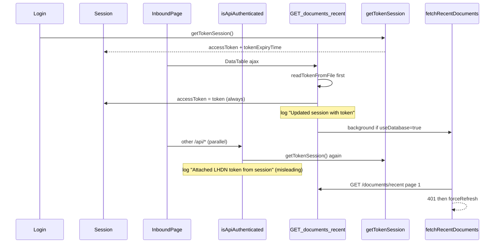
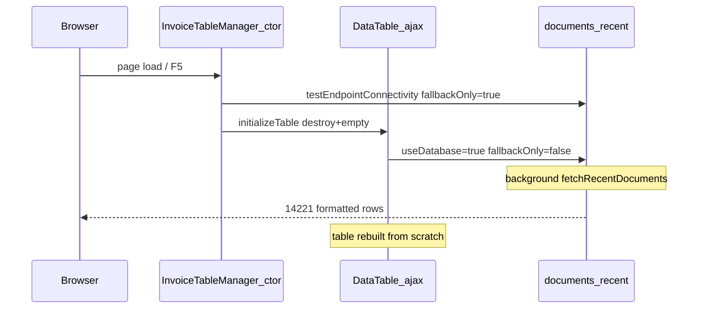

# Inbound LHDN token / session behavior

## What you are seeing (not a user session re-login)

The LHDN token is **not** the user’s login session. It is a **global MyInvois `client_credentials` token** (same for all users), obtained at login and stored in:

- `req.session.accessToken` ([`routes/auth-prisma.routes.js`](routes/auth-prisma.routes.js) ~232–240)
- `config/AuthorizeToken.ini`
- In-memory cache in [`services/token-prisma.service.js`](services/token-prisma.service.js)

Passport only serializes the **user profile** ([`config/passport-prisma.config.js`](config/passport-prisma.config.js) ~105–117); `accessToken` lives on the Express session object separately (this is OK).



Your log timeline matches this: UI returns **14,221 rows from DB** quickly, then **~11s later** background sync hits LHDN and 401s.

---

## Why it looks like “renewing session” on every inbound load

| Source | Behavior |
|--------|----------|
| [`GET /api/lhdn/documents/recent`](routes/api/lhdn.js) ~2023–2088 | Resolves token **file → session → `getTokenSession`**, then **always** sets `req.session.accessToken` and logs **"Updated session with token"** even when unchanged |
| [`isApiAuthenticated`](middleware/auth-prisma.middleware.js) ~407–415 | On **every** `/api/*` request, calls **`getTokenSession()`** (ignores session token first); log says “from session” but code uses global cache |
| [`tokenRefreshMiddleware`](middleware/token-refresh.middleware.js) on LHDN router ~1785 | If `req.session.tokenExpiryTime` is **0/unset**, `timeUntilExpiry < threshold` → may **POST `/connect/token` on every LHDN route** |
| [`getCachedDocuments`](routes/api/lhdn.js) ~946–950 | With `useDatabase=true` (inbound default in [`inbound-excel.js`](public/assets/js/modules/excel/inbound-excel.js) ~2330–2334), returns DB rows then **always starts background `fetchRecentDocuments`** |
| Parallel requests | Three `getTokenSession` logs at 22:04:39 = multiple `/api/*` calls on page load (table + dashboard/notifications/etc.) |

So the inbound page **does use login-time token indirectly** (via file/cache), but it **re-resolves and re-writes** it on each visit and **always triggers a background LHDN sync**.

---

## Why 401 persists after “Forced token refresh”

Token is requested from:

```text
https://api.myinvois.hasil.gov.my/connect/token
```

([`token-prisma.service.js`](services/token-prisma.service.js) uses `settings.middlewareUrl` only.)

Documents API uses [`getLhdnConfig()`](routes/api/lhdn.js) ~278–281:

```javascript
production ? settings.productionUrl || settings.middlewareUrl : settings.sandboxUrl || settings.middlewareUrl
```

If `productionUrl` and `middlewareUrl` differ, you can get a **valid token** that is **rejected on `/api/v1.0/documents/recent`** (401). Worth verifying in `WP_CONFIGURATION` LHDN settings.

---

## Recommended fixes (minimal, targeted)

### 1. Single token resolution helper (prefer login session)

Add e.g. `resolveLhdnAccessToken(req, { allowRefresh })` in [`services/token-prisma.service.js`](services/token-prisma.service.js):

1. `req.session.accessToken` if present and not forcing refresh  
2. Valid in-memory / file cache via existing `getTokenSession()`  
3. `getTokenSession({ forceRefresh: true })` only after 401 or explicit admin refresh  

Use this from:

- [`middleware/auth-prisma.middleware.js`](middleware/auth-prisma.middleware.js) — stop calling `getTokenSession()` on every request; attach `req.session.accessToken` when set, else resolve once  
- [`routes/api/lhdn.js`](routes/api/lhdn.js) `GET /documents/recent` — replace file-first + unconditional session overwrite; only update session when token **changed**  
- Keep existing 401 path: `invalidateTokenCache()` + `forceRefresh` (already added)

### 2. Fix `tokenRefreshMiddleware` false “always expired”

In [`middleware/token-refresh.middleware.js`](middleware/token-refresh.middleware.js):

- If `tokenExpiryTime` is missing, **do not refresh** (or set expiry when token is first attached at login)  
- Optionally call shared `invalidateTokenCache` + `getTokenSession({ forceRefresh })` instead of duplicating axios logic against `config.baseUrl` (today refresh may hit a **different host** than token-prisma)

### 3. Align token issuer URL with API base URL

In [`getTokenAsTaxPayer`](services/token-prisma.service.js), use the **same URL rule** as `getLhdnConfig()` in `lhdn.js` (`productionUrl` / `sandboxUrl` / `middlewareUrl`) so token and documents API share one environment.

### 4. Inbound background sync: less aggressive

In [`getCachedDocuments`](routes/api/lhdn.js):

- Respect existing DB sync gate in `fetchRecentDocumentsImpl` (15m / 5m non-terminal) **before** spawning background work  
- Add short **401 cooldown** (e.g. skip background sync for 5–10 min after auth failure) to prevent log storms  
- Optional query flag `skipBackgroundSync=true` from inbound initial load if you want DB-only until user clicks Refresh  

### 5. Logging cleanup

- Fix misleading log: “Attached … from session” → “Attached … from LHDN token cache”  
- Log “Updated session with token” only when token value changes  
- Downgrade repeated cache hits to debug in production  

---

## Why browser refresh re-calls API and resets the table

Your logs at **22:06:02** and **22:06:24** show the pattern clearly:

| Log line | Meaning |
|----------|---------|
| `Fallback only mode` | `fallbackOnly=true` — DB read only, no LHDN API |
| `Updated session with token` + `useDatabase: true` | Second call with `fallbackOnly=false` — **starts background LHDN sync** |
| `Sending response with formatted documents: 14221` | Server **maps/formats all 14,221 rows** (~7s CPU) |
| `[fetchRecentDocuments] API synced 100 docs` | Background sync ran (page 1 only) while UI already had DB data |

### Root causes (frontend)



1. **Duplicate calls on every load** — [`inbound-excel.js`](public/assets/js/modules/excel/inbound-excel.js) constructor (~566–568):
   - `testEndpointConnectivity()` → `GET .../documents/recent?fallbackOnly=true` (full DB query)
   - `initializeTable()` → DataTable ajax with **`fallbackOnly: false`** (~2334) → second full DB query + **background LHDN sync**

2. **Table always resets** — `initializeTable()` (~795–800) always `DataTable().destroy()`, `empty()`, loading skeleton, then rebuild. Browser F5 re-runs constructor → no preserved page/filter/sort.

3. **localStorage `useCache` is weak** — When cache TTL is valid, server returns `useCache: true` with empty `result`; client fills from localStorage but still paid for destroy + HTTP round-trip + often the second non-fallback call.

4. **Explicit Refresh** sets `forceRefreshLHDN` and `fallbackOnly=false` — correct for manual sync; **initial load should not use this path**.

### Root causes (backend)

1. **`getCachedDocuments`** ([`lhdn.js`](routes/api/lhdn.js) ~946–950) — After returning 14k DB rows, **always** fires `fetchRecentDocuments(req)` in background (ignores the 15m/5m sync gate that exists inside `fetchRecentDocumentsImpl` for the foreground path).

2. **Heavy response** — `GET /documents/recent` maps every row (`formattedDocuments = documents.map(...)`, ~2170+) on each request even when data unchanged.

3. **Duplicate hits** — Two parallel `documents/recent` requests per page load ≈ duplicate DB reads + duplicate formatting (matches your **22:06:35** and **22:06:44** “Sending response” lines).

---

## Inbound page optimization (recommended)

### A. Single load path (client)

In [`inbound-excel.js`](public/assets/js/modules/excel/inbound-excel.js):

- **Remove or defer** `testEndpointConnectivity()` on constructor (or replace with lightweight `HEAD`/health ping, not 14k-row fetch).
- **Initial DataTable ajax** use `fallbackOnly: true` and `skipBackgroundSync: true` (new query param, server-side).
- **localStorage-first bootstrap**: if `inboundTableData` + `lastDataUpdate` valid → `initializeTableWithLocalData()` immediately (no destroy delay); optionally `ajax.reload` in background only when stale.
- **Manual Refresh button only** sets `forceRefresh=true` + `fallbackOnly=false` (existing behavior ~1616–1618).

### B. Background sync gate (server)

In [`getCachedDocuments`](routes/api/lhdn.js):

- Do **not** spawn background `fetchRecentDocuments` when:
  - `fallbackOnly=true` or `skipBackgroundSync=true`, or
  - `last_sync_date` within threshold (reuse same logic as `fetchRecentDocumentsImpl` ~386–405), or
  - global **401 cooldown** active (from token section above).

### C. Faster DB-only responses (server)

In [`GET /documents/recent`](routes/api/lhdn.js):

- For `fromDatabase` / `fallbackOnly` responses: return rows **without** re-mapping 14k records if already stored in display shape, or add `?lightweight=true` that skips `formatDateForUI` per row (client can format on render for visible page only).
- Consider pagination endpoint later; short-term win is **one call, no background sync, no full map**.

### D. Preserve table UX (client)

- Enable DataTable `stateSave: true` (page length, search, sort) in sessionStorage.
- On F5 with valid cache: skip `destroy()` if table already initialized with same source; use `ajax.reload(null, false)` to keep paging.

### Expected outcome after optimization

| Action | Before | After |
|--------|--------|-------|
| Browser F5 | 2× `documents/recent`, background LHDN, table destroyed | 0–1 DB-only call or localStorage only; table state preserved |
| Manual Refresh | Full sync (intended) | Unchanged |
| PM2 logs | Token + API spam | Quiet unless sync due or user refresh |

---

## Verification after implementation

1. Login once → confirm **one** token acquisition in logs  
2. Open inbound → **one** token attach per logical operation; **no** flood of `getTokenSession` unless cache empty  
3. Background sync either succeeds or **one** 401 + **one** forced refresh, then stops (no loop)  
4. Confirm `WP_CONFIGURATION` LHDN `productionUrl` / `middlewareUrl` / `clientId` / `clientSecret` match MyInvois production environment  
5. Browser F5 on inbound → at most one lightweight DB read; no duplicate `documents/recent`; table keeps page/search when cache valid  
6. PM2 logs quiet for 15m after load unless user clicks Refresh or non-terminal rows need 5m sync  

---

## Out of scope (ops, not code)

- `NODE_TLS_REJECT_UNAUTHORIZED=0` — dev-only warning; remove in production when certs are valid  
- PM2 restart required after deploying JS changes
