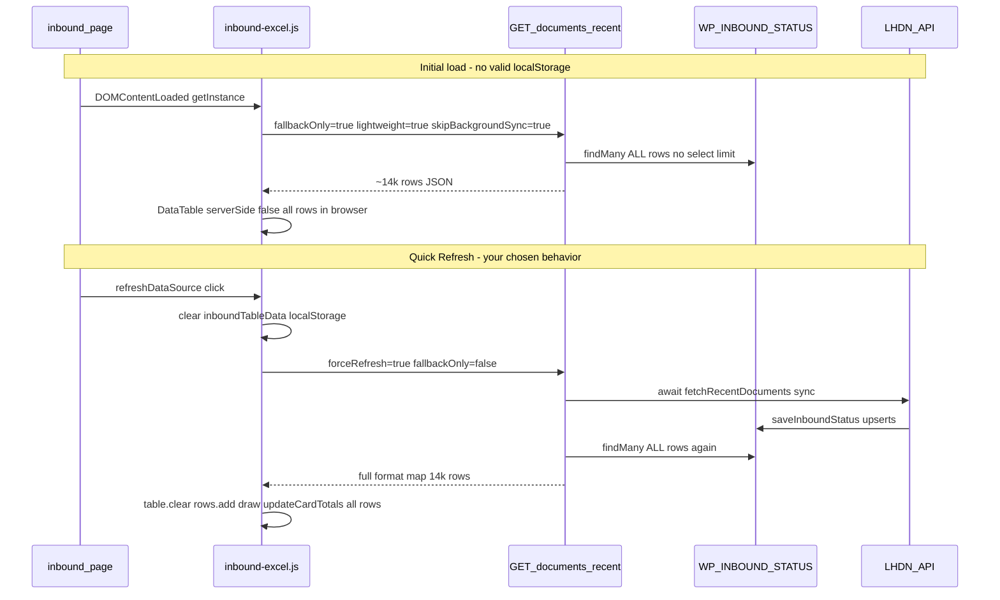
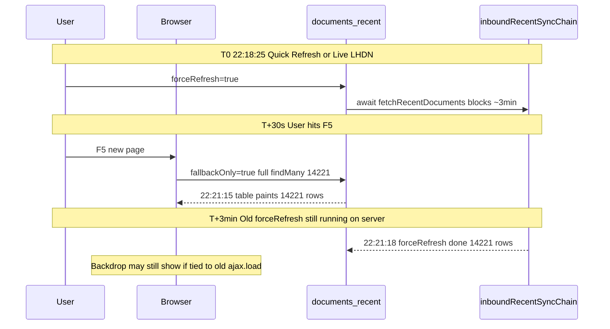
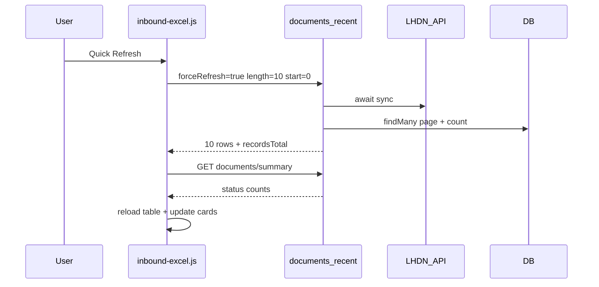

# Inbound page load and refresh performance

## What you asked for

- **Why** the inbound “Database View” stays on “Loading…” and feels slow on first load and again on Quick Refresh.
- **Whether caching helps** so refresh only pulls **new/changed** data.
- **Constraint (your answers):** Keep Quick Refresh = **await LHDN sync**, then refresh grid. Prioritize **server-side pagination** over slim-payload-only.

---

## Current workflow (verified in code)

| Step | File | Behavior |
|------|------|----------|
| Page entry | [`views/dashboard/inbound.html`](views/dashboard/inbound.html) | Table `#invoiceTable`, Quick Refresh `#refreshDataSource` |
| Client orchestration | [`public/assets/js/modules/excel/inbound-excel.js`](public/assets/js/modules/excel/inbound-excel.js) | `InvoiceTableManager`: cache-first OR DataTable ajax |
| API | [`routes/api/lhdn.js`](routes/api/lhdn.js) `GET /api/lhdn/documents/recent` | All paths use `prisma.wP_INBOUND_STATUS.findMany()` **without `take`/`skip` or column `select`** |
| Quick Refresh | `performIncrementalRefresh()` ~L1659 | `forceRefresh=true` → **`getCachedDocuments` awaits LHDN** then full DB read |
| “Cache” today | `localStorage` `inboundTableData` | Stores **entire table** (5m TTL, 2m if non-terminal); Quick Refresh **deletes** it |

Existing plan doc [`/.cursor/plans/inbound_lhdn_token_flow_c2dca7bd.plan.md`](.cursor/plans/inbound_lhdn_token_flow_c2dca7bd.plan.md) already notes **~14,221 rows** and duplicate heavy formatting—still accurate for the non-paginated path.

**Reference pattern:** [`public/assets/js/audit-trail.js`](public/assets/js/audit-trail.js) already uses `serverSide: true` with `page`/`length` mapped to the API.

---

## Root causes (why load and refresh both hurt)

1. **Unbounded DB read + payload** — Every list request loads **all rows** and serializes `document`, `documentDetails`, `validationResults` (`@db.Text` in [`prisma/schema.prisma`](prisma/schema.prisma) L140–144). Network + `JSON.parse` + DataTables DOM scale with 14k.
2. **Client-side grid** — `serverSide: false` ([`inbound-excel.js`](public/assets/js/modules/excel/inbound-excel.js) ~L2353) means pagination/search/filters run in-browser on the full dataset; `updateCardTotals()` scans **every row** on each `drawCallback` (~L3673).
3. **Quick Refresh is heavier than initial load** — Initial ajax uses `fallbackOnly=true` (DB-only, no LHDN wait). Quick Refresh uses `forceRefresh=true` ([`lhdn.js`](routes/api/lhdn.js) ~L883–911): **blocks on LHDN sync** + second full `findMany` + **non-lightweight** formatting (`lightweight` false when `forceRefresh` — ~L2293–2300).
4. **Caching is the wrong shape** — Full-table `localStorage` avoids one network call when TTL is valid, but still holds 14k rows in the browser; refresh **intentionally clears** it. There is **no server list cache** and **no delta/changed-since** API for the grid.
5. **UX copy mismatch** — Tooltip on Quick Refresh says “database” ([`inbound.html`](views/dashboard/inbound.html) L687), but code always syncs LHDN on incremental refresh (toast: “Synced with LHDN”). You chose to **keep** LHDN sync—tooltip/toast should be updated to match.

**Not the main bottleneck:** LHDN validation queue note on the page (external 24h processing)—that explains status lag, not 14k-row download time.

---

## F5 (browser refresh) vs Quick Refresh — your logs explained

You reported **F5**, not Quick Refresh. The PM2 timeline shows **two different behaviors overlapping**, which explains “stuck on Searching Current Month’s Documents” while the table already shows **14,221 records**.

### Log timeline (2026-06-03)

| Time | Log | Meaning |
|------|-----|---------|
| **22:18:25** | `[getCachedDocuments] forceRefresh=true — awaiting fetchRecentDocuments` | **Quick Refresh or Live LHDN** (`switchToLiveData` sets `window.forceRefreshLHDN=true` → ajax `forceRefresh`) — starts **blocking LHDN sync** on server |
| **22:18:55** | `Fallback only mode requested` | **~30s later** — separate request (likely **F5** or parallel DataTable ajax) with `fallbackOnly=true` — DB-only, no LHDN wait |
| **22:21:06** | `Fallback only mode requested` (again) | **F5** — same DB-only path |
| **22:21:15** | `Found 14221 documents in database for fallback` | Full `findMany` took **~9s** (DB + JSON build) |
| **22:21:16** | `[fetchRecentDocuments] API synced 100 docs, returning 14221 total from DB` | **Finishing the 22:18:25 `forceRefresh` job** (~3 minutes later), not started by this F5 |
| **22:21:18** | `[getCachedDocuments] forceRefresh done — returning 14221 records` | That **orphaned** `forceRefresh` finally completes |

### Why the UI looks “stuck”

1. **Modal text** — `"Searching Current Month's Documents"` is only set in [`switchToLiveData()`](public/assets/js/modules/excel/inbound-excel.js) (~L1446). `hideLoadingBackdrop()` runs **only** inside that method’s `table.ajax.load()` callback (~L1460). If the **slow `forceRefresh` request** (minutes) never completes or errors without calling the callback, the backdrop **stays forever** even after F5’s **fallback** request fills the grid.
2. **F5 does not start `forceRefresh`** — Your 22:21:06 log is correct: F5 uses `fallbackOnly=true` ([`inbound-excel.js`](public/assets/js/modules/excel/inbound-excel.js) ajax `data` ~L2392). Slowness on F5 is still **14,221-row download + client render**, not LHDN sync on that request.
3. **Global sync queue** — [`inboundRecentSyncChain`](routes/api/lhdn.js) (~L865–868) serializes `fetchRecentDocuments`. A **prior** `forceRefresh` from Quick Refresh/Live can keep the server busy for minutes; F5’s fallback DB read can still run in parallel, but any later `forceRefresh` or background sync **waits behind** the old job.
4. **Duplicate page init** — Two `DOMContentLoaded` handlers (~L181 and ~L7275) both call `InvoiceTableManager.getInstance()`; singleton prevents double table, but increases risk of overlapping requests during dev/hot reload.

### F5-specific fixes (add to implementation)

| Fix | Where |
|-----|--------|
| **F5 = DB-only paged load** | Never set `forceRefresh` / `forceRefreshLHDN` on constructor or first ajax; only Quick Refresh / Live LHDN |
| **Always clear backdrop** | `ajax.complete` / `error` + `beforeunload` on F5; `hideLoadingBackdrop()` even when fallback wins |
| **Abort stale sync** | Optional `syncRequestId` query param; ignore chain results if client navigated away (F5) |
| **Pagination on fallback** | F5 `fallbackOnly` returns **one page** (~10 rows) in &lt;1s instead of 9s+ for 14k |
| **No full-table localStorage on F5** | Cache-first path still hydrates 14k in browser — disable when pagination ships |

---

## Recommended strategy

Keep your Quick Refresh semantics: **sync LHDN first, then refresh the grid**—but change the grid to **never require 14k rows in one response**.

### Phase 1 — Paginated list API (backend)

Extend [`GET /api/lhdn/documents/recent`](routes/api/lhdn.js) (or add `GET /api/lhdn/documents/recent-paged` to avoid breaking other callers) with DataTables-friendly params:

| Param | Purpose |
|-------|---------|
| `start`, `length` | `skip` / `take` (default length 10) |
| `search[value]` | Global search across uuid, internalId, issuerName, receiverName, status |
| `statusFilter` | Maps UI chips: All / Valid / Invalid / Cancelled / Queue |
| `order[0][column]`, `order[0][dir]` | Map to `orderBy` (default `dateTimeReceived desc`) |
| Existing | `forceRefresh`, `fallbackOnly`, `useDatabase`, `lightweight` |

Implementation details:

- **`select`** only grid columns (exclude `document`, `documentDetails`, `validationResults`).
- **`count()`** for `recordsTotal`; filtered count for `recordsFiltered` (Prisma `where` + `count`).
- **`forceRefresh` path:** still `await fetchRecentDocuments(req)` once, then return **only the requested page** from DB (do not build 14k formatted objects).
- Keep `formatInboundDocumentsForResponse` for **page rows only** (or always `lightweight` for list).

### Phase 2 — Server-side DataTable (frontend)

In [`inbound-excel.js`](public/assets/js/modules/excel/inbound-excel.js):

- Set `serverSide: true`, `processing: true` on `#invoiceTable` (mirror [`audit-trail.js`](public/assets/js/audit-trail.js)).
- Map DataTables `d.start` / `d.length` / `d.search` / `d.order` into query params.
- **`dataSrc`:** set `json.recordsTotal` and `json.recordsFiltered` from API metadata; return `json.result` as row array.
- **Quick Refresh:** after LHDN sync response, call `this.table.ajax.reload(null, false)` (current page preserved) instead of `clear()` + `rows.add(14000)`.
- **Remove or stop using** full-table `localStorage` (`inboundTableData`); optional: keep only `lastLhdnSyncAt` timestamp for UI badge.

Wire filters to server (required with server-side mode):

- [`initializeFilters()`](public/assets/js/modules/excel/inbound-excel.js) ~L2961: status chips, `#globalSearch`, date/amount/company filters → `ajax.reload()` with extra query params (today they use `column().search()` on full client dataset).

### Phase 3 — Summary / stats without scanning all rows

- Add `GET /api/lhdn/documents/summary` (or extend [`/documents/recent-total`](routes/api/lhdn.js) ~L2705) returning SQL aggregates, e.g. `GROUP BY status` counts + optional totals for cards/charts.
- Change `updateCardTotals()` and chart init to fetch summary once per load/refresh, not `table.rows().data().each` over 14k.

Reuse ideas from [`routes/api/dashboard-analytics.js`](routes/api/dashboard-analytics.js) inbound SQL if already maintained.

### Phase 4 — Caching aligned with your refresh workflow

After pagination, “cache” means:

| Layer | What to cache | When invalidated |
|-------|----------------|------------------|
| **Browser** | DataTables `stateSave` (page/sort/search) + optional `lastSyncAt` | User Quick Refresh after LHDN sync completes |
| **Server (optional v2)** | Short TTL in-memory key: `inbound:list:{hash(filters)}:{page}` | `forceRefresh` or any `saveInboundStatus` during sync |
| **Not recommended** | Full 14k `localStorage` blob | Too large; fights pagination |

**Delta refresh (optional v2):** After LHDN sync, return `{ changedCount, maxUpdatedAt }` plus only rows where `updated_at` / `last_sync_date` > client `since`—useful for status monitor, not required for first pagination ship.

Quick Refresh flow after changes:

LHDN sync time remains (your requirement); **perceived** improvement comes from not downloading/rendering 14k rows afterward.

### Phase 5 — Cleanup and correctness

- Update Quick Refresh tooltip/toast to say **LHDN sync + DB reload** (not “database only”).
- Fix misleading “incremental” naming in `performIncrementalRefresh` (full LHDN sync + full table replace today).
- **F5 / stuck modal:** `switchToLiveData` — `hideLoadingBackdrop()` in `ajax.error` and a **120s timeout**; cancel in-flight `forceRefresh` xhr on `beforeunload`; do not start Live/sync on page load (radio `checked` must not auto-fire `change` on init).
- **Merge duplicate `DOMContentLoaded`** (~L181 + ~L7275) into one init block.
- Review **60s** `POST /api/lhdn/status-check` ([`inbound-excel.js`](public/assets/js/modules/excel/inbound-excel.js) `setupRealTimeStatusMonitoring`) so it does not trigger another 14k reload on change detection—should call `ajax.reload` + summary only.
- Add index if needed for filter columns (status already indexed; consider composite `(status, dateTimeReceived)` only if profiling shows need).

---

## Files to change (primary)

| File | Changes |
|------|---------|
| [`routes/api/lhdn.js`](routes/api/lhdn.js) | Paginated `findMany` + `count`; slim `select`; summary endpoint; paginate post-`forceRefresh` |
| [`public/assets/js/modules/excel/inbound-excel.js`](public/assets/js/modules/excel/inbound-excel.js) | `serverSide: true`, ajax param mapping, refresh → `ajax.reload`, filters → server, drop full localStorage table cache |
| [`views/dashboard/inbound.html`](views/dashboard/inbound.html) | Tooltip copy for Quick Refresh |
| Optional test | Extend [`test/inbound-status-sync.test.js`](test/inbound-status-sync.test.js) for paging + `forceRefresh` still calls sync |

---

## Success criteria

- **F5:** Table first page visible in **&lt;3s**; no `forceRefresh` in logs; no stuck “Searching Current Month’s Documents” overlay.
- First paint (cold): same as F5 when cache miss.
- Quick Refresh: still runs LHDN sync, but UI reloads **one page + summary**, not 14k rows; backdrop clears on success, error, or timeout.
- Pagination/search/status filters work against DB, not in-memory full set.
- Card totals/charts correct via summary API, not O(n) client scan.

---

## Out of scope (unless you ask later)

- Changing LHDN external validation SLA.
- Removing LHDN sync from Quick Refresh (you declined).
- Full sync `/documents/search` auto-trigger (`needsFullSync` when length === 100)—separate from pagination; revisit if still firing on large tenants.
