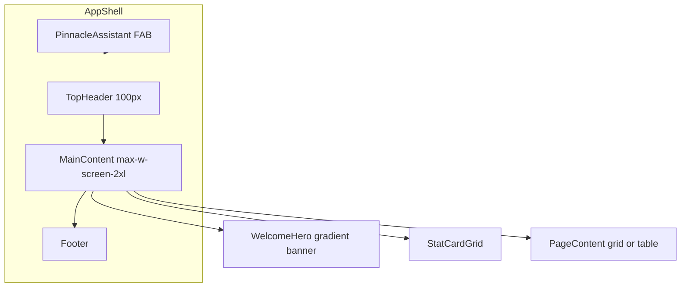

# PINNACLE e-Invoice Design System

> **Version:** 3.1.4 · **Author:** Pixelcare Consulting · **Last updated:** August 2026  
> **Purpose:** Authoritative design specification for rebuilding the Tradewinds/PINNACLE e-invoice portal in **Next.js 15 App Router + Tailwind CSS + shadcn/ui**.

**Live reference:** [e-invoice.tradewindscorp-insbrok.com](https://e-invoice.tradewindscorp-insbrok.com/dashboard)

---

## Table of Contents

1. [Introduction and Principles](#1-introduction-and-principles)
2. [Brand Identity](#2-brand-identity)
3. [Color System](#3-color-system)
4. [Typography](#4-typography)
5. [Spacing, Radius, and Shadows](#5-spacing-radius-and-shadows)
6. [Layout Architecture](#6-layout-architecture)
7. [Component Library](#7-component-library)
8. [Page Inventory and Route Map](#8-page-inventory-and-route-map)
9. [Data Visualization](#9-data-visualization)
10. [Icons](#10-icons)
11. [Responsive Behavior](#11-responsive-behavior)
12. [Next.js Implementation Appendix](#12-nextjs-implementation-appendix)
13. [Accessibility and UX Notes](#13-accessibility-and-ux-notes)
14. [Legacy Cleanup Guidance](#14-legacy-cleanup-guidance)

---

## 1. Introduction and Principles

### 1.1 Product Overview

**PINNACLE e-invoice solution** is an enterprise middleware portal by Pixelcare Consulting that integrates business applications with Malaysia's LHDN (Lembaga Hasil Dalam Negeri) e-Invoicing system. The UI serves finance teams, administrators, and compliance officers who manage outbound invoice submission, inbound receipt, validation, and LHDN status monitoring.

### 1.2 Design Language

| Attribute | Description |
|-----------|-------------|
| **Tone** | Clean enterprise dashboard — professional, trustworthy, compliance-focused |
| **Structure** | White cards on muted page background; navy gradient heroes; no global sidebar |
| **Density** | Medium — readable tables, compact badges, generous card padding |
| **Motion** | Subtle hover lifts (`translateY(-2px)`), 150–300ms transitions, pulse on status dots |
| **Data emphasis** | Status colors are semantic and consistent across tables, charts, and badges |

### 1.3 Rebuild Stack

| Layer | Technology |
|-------|------------|
| Framework | Next.js 15 App Router (React 19) |
| Styling | Tailwind CSS v4 (utility-first) |
| Components | shadcn/ui + class-variance-authority (`cva`) |
| Icons | Lucide React (replaces Bootstrap Icons + Font Awesome) |
| Tables | TanStack Table + shadcn `Table` |
| Charts | Chart.js (primary) or Recharts |
| File upload | react-dropzone inside shadcn `Dialog` |
| Toasts | Sonner |
| Confirmations | shadcn `AlertDialog` (replaces SweetAlert2) |
| Fonts | Inter (body), Nunito (headings), JetBrains Mono (UIDs/code) |

### 1.4 Design Principles

1. **Navy is structural** — navigation, heroes, primary CTAs, modal headers.
2. **Indigo is accent** — charts, secondary highlights, activity hover states.
3. **Status colors are sacred** — invoice lifecycle badges must match across all surfaces.
4. **One icon library** — Lucide only in the Next.js rebuild.
5. **One chart library** — Chart.js (ApexCharts is loaded in legacy but unused as primary).
6. **Mobile-first breakpoints** — collapse nav at 768px, stat grid at 1400px/768px.

### 1.5 Visual References (Screenshots)

| Screenshot | Path | Shows |
|------------|------|-------|
| Dashboard | `assets/c__Users_Yobb_AppData_Roaming_Cursor_User_workspaceStorage_37d1febedd74477fde767bd2f015117f_images_image-fb1437aa-e3e5-4df4-a93d-29a6b635766d.png` | Navy hero, 3-column stat cards, chart grid, LHDN status panel |
| Outbound Upload Modal | `assets/c__Users_Yobb_AppData_Roaming_Cursor_User_workspaceStorage_37d1febedd74477fde767bd2f015117f_images_image-437280ff-407c-4307-b7c9-61c0c00caa08.png` | Two-column Excel upload: requirements panel + dropzone |
| Design System Reference | `assets/c__Users_Yobb_AppData_Roaming_Cursor_User_workspaceStorage_37d1febedd74477fde767bd2f015117f_images_image-235e0e9f-a1fa-4287-adc6-1d078f5bc0f2.png` | Upload modal design system alignment |

---

## 2. Brand Identity

### 2.1 Logo and Naming

| Asset | Path | Usage |
|-------|------|-------|
| Primary logo | `/images/PXCLogo.svg` | Header brand link, auth card header, favicon source |
| Product name | **PINNACLE** | Display in auth, marketing copy |
| Subtitle | **e-invoice solution** | Below product name on auth card |
| Full product string | Pinnacle e-Invoice Middleware Portal | Footer copyright |

### 2.2 Header Brand Spec

```css
.header-brand {
  color: #405189;
  font-weight: 600;
  font-size: 1.1rem; /* 17.6px */
}
.header-brand img {
  height: 100px;
  margin-right: 12px;
}
```

### 2.3 Footer

```
© Copyright Pinnacle e-Invoice Middleware Portal. All Rights Reserved 2025–2026
| Designed by Pixelcare Consulting
Build 3.1.4
```

### 2.4 Voice and Tone (UI Copy)

- Use clear, compliance-aware language: "Submit to LHDN", "Validation Results", "Upload Requirements".
- Avoid jargon in user-facing errors; provide actionable steps (see outbound error modals).
- Admin badge visible for admin users only.

---

## 3. Color System

The live UI uses a **dual palette**. Consolidate to these two families in the Next.js rebuild.

### 3.1 Usage Rule

| Palette | Use For | Do Not Use For |
|---------|---------|----------------|
| **Navy (Primary)** | Nav active state, hero banners, modal headers, primary buttons, pagination active, tooltips | Chart segment fills (use semantic status colors) |
| **Indigo (Secondary)** | Chart accents, activity hover, upload icon pulse (legacy), focus rings on search inputs | Primary navigation background |
| **Semantic Status** | Badges, chart segments, alert backgrounds | Navigation or hero backgrounds |

### 3.2 Primary — Navy Brand

Extracted from `header.html`, `welcome-card.css`, `outbound-table.css`, and inline hero styles.

| Token | Hex | CSS Variable | Usage |
|-------|-----|--------------|-------|
| Brand Navy | `#405189` | `--brand-navy` | Nav active bg, brand text, primary buttons, cell-main text, tooltips |
| Brand Start | `#1e3c72` | `--brand-start` | Gradient start, row action buttons, checkbox checked (outbound) |
| Brand End | `#2a5298` | `--brand-end` | Gradient end, chat header |
| Brand Gradient | `linear-gradient(135deg, #1e3c72 0%, #2a5298 100%)` | `--brand-gradient` | Heroes, modal headers, chart card headers, pagination active |
| LHDN Button | `#1a365d` | `--lhdn-btn` | `.btn-lhdn` background |
| LHDN Button Hover | `#2d3748` | `--lhdn-btn-hover` | `.btn-lhdn:hover` |

### 3.3 Surfaces and Neutrals

| Token | Hex | CSS Variable | Usage |
|-------|-----|--------------|-------|
| Surface | `#ffffff` | `--surface` | Cards, modals, table backgrounds |
| Surface Muted | `#f8f9fa` | `--surface-muted` | Table controls, requirement items, chat messages bg |
| Page Background | `#f1f5f9` | `--page-bg` | Main content area (`container-fluid`) |
| Border | `#e9ecef` | `--border` | Card borders, table row dividers, header bottom border |
| Border Alt | `#e2e8f0` | `--border-alt` | DataTable controls, outbound table headers |
| Text Primary | `#2d3748` | `--text-primary` | Headings, requirement labels, LHDN status labels |
| Text Body | `#475569` | `--text-body` | Table cell text, form labels |
| Text Muted | `#718096` | `--text-muted` | Subtitles, requirement values, info text |
| Nav Link | `#6c757d` | `--nav-link` | Inactive navigation links |

### 3.4 Secondary — Indigo v2

From `dashboard-v2.css` — use for data visualization accents and modern card hover states.

| Token | Hex | CSS Variable | Usage |
|-------|-----|--------------|-------|
| Indigo Primary | `#6366f1` | `--indigo-primary` | Activity hover bg tint, v2 metric accents |
| Indigo Light | `#a5b4fc` | `--indigo-light` | Light backgrounds, disabled accents |
| Indigo Dark | `#4338ca` | `--indigo-dark` | Hover states on indigo elements |
| Upload Icon (legacy) | `#667eea` | — | Upload dropzone icon/pulse (migrate to navy in rebuild) |

### 3.5 Semantic Status Colors

Critical for invoice lifecycle — must be identical in tables, badges, and charts.

#### Core Status Badge Map

| Status | Background | Text | Border/Accent | Icon |
|--------|-----------|------|---------------|------|
| **Valid** | `#dcfce7` | `#15803d` | `#28a745` | `CheckCircle` |
| **Invalid** | `#fee2e2` | `#dc2626` | `#dc3545` | `XCircle` |
| **Pending** | `#fff3cd` / `#fff8dd` | `#ca8a04` / `#997404` | `#ffc107` | `Clock` |
| **Submitted** | `#dbeafe` / `#dcfce7` | `#2563eb` / `#166534` | `#0ea5e9` | `Send` |
| **Cancelled** | `#fef9c3` / `#fee2e2` | `#ca8a04` / `#991b1b` | `#ffc107` | `Ban` |
| **Rejected** | `#fef2f2` | `#b91c1c` | `#dc3545` | `AlertTriangle` |

> **Note:** Outbound table uses slightly different text shades for submitted/cancelled vs. global `table.css`. Standardize on the **Core Status Badge Map** above in the rebuild.

#### Stat Card Top Borders

| Card Variant | Top Border | Icon BG | Icon Color |
|--------------|-----------|---------|------------|
| Invoices / Outbound | `#0d6efd` | `rgba(13,110,253,0.1)` | `#0d6efd` |
| Submitted / Valid | `#198754` | `rgba(25,135,84,0.1)` | `#198754` |
| Pending | `#fd7e14` | `rgba(253,126,20,0.1)` | `#fd7e14` |
| Cancelled | `#ffc107` | `rgba(255,193,7,0.1)` | `#ffc107` |

#### Document Type / Source Badges

| Variant | Background | Text |
|---------|-----------|------|
| Invoice / Manual / Incoming | `#e0f2fe` / `#dbeafe` | `#0369a1` / `#2563eb` |
| Schedule | `#f0fdf4` | `#166534` |
| Admin badge | `#dc3545` | `#ffffff` |

#### System Status Indicators

| State | Background | Text |
|-------|-----------|------|
| Online | `rgba(40,167,69,0.1)` | `#28a745` |
| Warning | `rgba(255,193,7,0.1)` | `#ffc107` |
| Error | `rgba(239,68,68,0.1)` | `#dc2626` |

### 3.6 Button Color Variants

| Variant | Background | Text | Hover | Usage |
|---------|-----------|------|-------|-------|
| Primary (Navy) | `#405189` | white | `#364574` | Export, bulk actions |
| Primary Gradient | `brand-gradient` | white | darken 5% | Upload CTA, hero buttons |
| LHDN Branded | `#1a365d` | white | `#2d3748` | TIN validation, LHDN actions |
| LHDN Sky | `#0ea5e9` | white | `#0284c7` | LHDN portal links |
| Success | `#198754` | white | `#155a3a` | Confirm submit |
| Destructive | `#dc3545` | white | `#c82333` | Bulk delete, row delete |
| Outline Secondary | white | `#495057` | `#f8f9fa` bg | Cancel, back |
| Pagination Active | `brand-gradient` | white | — | Current page |

### 3.7 Chart Color Palette

Align chart segments to semantic status colors:

```typescript
const CHART_COLORS = {
  valid:     '#28a745',
  invalid:   '#dc3545',
  pending:   '#ffc107',
  submitted: '#0ea5e9',
  cancelled: '#ca8a04',
  primary:   '#405189',
  secondary: '#6366f1',
};
```

---

## 4. Typography

### 4.1 Font Families

| Role | Family | Fallback | Tailwind Key |
|------|--------|----------|--------------|
| Body | Inter | `-apple-system, BlinkMacSystemFont, 'Segoe UI', Roboto, sans-serif` | `font-sans` |
| Headings | Nunito | Inter semibold (acceptable fallback) | `font-heading` |
| Monospace | JetBrains Mono | `'SF Mono', ui-monospace, Menlo, Consolas, monospace` | `font-mono` |

Load via `next/font/google`:

```typescript
import { Inter, Nunito, JetBrains_Mono } from 'next/font/google';
```

### 4.2 Type Scale

| Role | Size | Weight | Line Height | Letter Spacing | Tailwind |
|------|------|--------|-------------|----------------|----------|
| Body | 15px / 0.9375rem | 400 | 1.6 | normal | `text-sm` |
| Body Small | 14px / 0.875rem | 400 | 1.5 | normal | `text-sm` |
| H1 (page) | 2rem / 32px | 600 | 1.2 | -0.02em | `text-3xl font-semibold` |
| H3 (hero) | 1.5rem / 24px | 600 | 1.3 | normal | `text-2xl font-semibold` |
| H5 (card title) | 1.1rem / 17.6px | 700 | 1.3 | -0.02em | `text-lg font-bold` |
| Card Label | 0.75rem / 12px | 600 | 1 | 0.5px, uppercase | `text-xs font-semibold uppercase tracking-wide` |
| Stat Number | 1.75rem / 28px | 700 | 1 | normal | `text-3xl font-bold` |
| Stat Number (dashboard) | 2rem / 32px | 700 | 1.2 | normal | `text-3xl font-bold` |
| Badge | 0.75rem / 12px | 500 | 1 | normal | `text-xs font-medium` |
| Table Cell | 0.875rem / 14px | 400 | 1.4 | normal | `text-sm` |
| Table Header | 0.775rem / 12.4px | 800 | 1.2 | uppercase | `text-xs font-extrabold uppercase` |
| Monospace UID | 0.75rem / 12px | 400 | 1.4 | normal | `text-xs font-mono` |
| Live Clock | 2rem / 32px | 600 | 1 | 0.5px | `text-3xl font-semibold` |
| Modal Title | 1rem–1.1rem | 600 | 1.3 | normal | `text-lg font-semibold` |
| Footer Version | 0.875rem | 400 | 1.4 | normal | `text-sm text-muted-foreground` |

### 4.3 Text Colors

| Usage | Color | Tailwind |
|-------|-------|----------|
| Primary text | `#2d3748` | `text-foreground` |
| Body text | `#475569` | `text-muted-foreground` |
| Muted / labels | `#718096` / `#6c757d` | `text-muted-foreground` |
| Link / UID | `#2563eb` | `text-blue-600` |
| Link hover | `#1d4ed8` | `hover:text-blue-700` |
| On gradient | `#ffffff` / `rgba(255,255,255,0.9)` | `text-white` |
| Error | `#dc2626` | `text-destructive` |
| Success | `#15803d` | `text-green-700` |

---

## 5. Spacing, Radius, and Shadows

### 5.1 Spacing Scale

From `dashboard-v2.css` and component usage:

| Token | Value | Tailwind | Common Usage |
|-------|-------|----------|--------------|
| `xs` | 4px / 0.25rem | `p-1`, `gap-1` | Badge padding, tight gaps |
| `sm` | 8px / 0.5rem | `p-2`, `gap-2` | Icon gaps, compact padding |
| `md` | 16px / 1rem | `p-4`, `gap-4` | Card body, table cell padding |
| `lg` | 24px / 1.5rem | `p-6`, `gap-6` | Section padding, chart padding |
| `xl` | 32px / 2rem | `p-8` | Hero padding, modal sections |
| `2xl` | 48px / 3rem | `p-12` | Large modal padding |

**Page gutters:** `px-4 md:px-8 lg:px-12` (maps to `px-3 px-md-4 px-lg-5` in Bootstrap)

**Card grid gap:** `1.25rem` (20px) — use `gap-5`

### 5.2 Border Radius

| Token | Value | Tailwind | Usage |
|-------|-------|----------|-------|
| `sm` | 6px / 0.375rem | `rounded-md` | Badges, small inputs |
| `md` | 8px / 0.5rem | `rounded-lg` | Buttons, nav pills, inputs |
| `lg` | 12px / 0.75rem | `rounded-xl` | Welcome icon, modal icon wrapper |
| `xl` | 16px / 1rem | `rounded-2xl` | Cards, chart containers, modals |
| `2xl` | 18–20px / 1.125rem | `rounded-2xl` | Info cards (`border-radius: 18px`) |
| `full` | 9999px | `rounded-full` | Status pills, avatars, admin badge |

### 5.3 Shadows

| Token | Value | Usage |
|-------|-------|-------|
| Card default | `0 4px 12px rgba(0,0,0,0.05), 0 1px 3px rgba(0,0,0,0.03)` | Info cards |
| Card hover | `0 8px 16px rgba(0,0,0,0.08), 0 2px 4px rgba(0,0,0,0.04)` | Info card hover |
| Header | `0 2px 4px rgba(0,0,0,0.1)` | Top header |
| Chart card | `0 8px 32px rgba(0,0,0,0.08)` | Dashboard chart wrappers |
| LHDN panel | `0 8px 32px rgba(30,60,114,0.15)` | System status card |
| Modal | `0 25px 50px rgba(0,0,0,0.15)` | Upload modal |
| Dropdown | `0 10px 30px rgba(0,0,0,0.15)` | User menu |
| Row action | `0 1px 3px rgba(30,60,114,0.06)` | Outbound row action buttons |

### 5.4 Transitions

| Token | Duration | Easing | Usage |
|-------|----------|--------|-------|
| Fast | 150ms | `cubic-bezier(0.4, 0, 0.2, 1)` | Button hover, badge scale |
| Normal | 300ms | `cubic-bezier(0.4, 0, 0.2, 1)` | Card lift, nav state |
| Slow | 500ms | `cubic-bezier(0.4, 0, 0.2, 1)` | Dropdown shimmer |

---

## 6. Layout Architecture

### 6.1 App Shell Diagram



### 6.2 Shell Specifications

| Element | Spec |
|---------|------|
| **Top Header** | 100px height, white bg, `border-bottom: 1px solid #e9ecef`, `box-shadow: 0 2px 4px rgba(0,0,0,0.1)`, `z-index: 999` |
| **Logo area** | Left: PXCLogo.svg (100px height) + brand text `#405189` |
| **Center Nav** | Horizontal pill links: Dashboard, Outbound (Manual), Inbound |
| **Right** | User dropdown: avatar (36px circle), username, admin badge, chevron |
| **No global sidebar** | Exception: settings/help/changelog pages use local left nav |
| **Main content** | `min-height: calc(100vh - header - footer)`, bg `#f1f5f9` |
| **Container** | `max-w-screen-2xl mx-auto`, padding `px-4 md:px-8 lg:px-12` |
| **Footer** | Copyright + version badge `3.1.4` |
| **Chat widget** | Fixed bottom-right, 360px wide, collapsed to 50px header strip |

### 6.3 Repeated Page Template

Used on Dashboard, Inbound, Outbound Manual:

```
┌─────────────────────────────────────────────────────────────┐
│  TOP HEADER (100px) — Logo | Nav Pills | User Dropdown      │
├─────────────────────────────────────────────────────────────┤
│  ┌───────────────────────────────────────────────────────┐  │
│  │  WELCOME HERO — Navy gradient, icon + title + clock   │  │
│  └───────────────────────────────────────────────────────┘  │
│  ┌──────────┐ ┌──────────┐ ┌──────────┐ ┌──────────┐       │
│  │ StatCard │ │ StatCard │ │ StatCard │ │ StatCard │       │
│  └──────────┘ └──────────┘ └──────────┘ └──────────┘       │
│  ┌───────────────────────────────────────────────────────┐  │
│  │  CONTENT SECTION — charts / filters / data table      │  │
│  └───────────────────────────────────────────────────────┘  │
│  ┌───────────────────────────────────────────────────────┐  │
│  │  INFO NOTICE — help text, consolidation notes         │  │
│  └───────────────────────────────────────────────────────┘  │
├─────────────────────────────────────────────────────────────┤
│  FOOTER — Copyright | Designed by Pixelcare | v3.1.4        │
└─────────────────────────────────────────────────────────────┘
                                        ┌──────────────┐
                                        │ Pinnacle     │
                                        │ Assistant    │
                                        └──────────────┘
```

### 6.4 Dashboard Layout (3-Column Grid)

```
┌──────────────────────────────────────────────────────────────────┐
│ HERO: Dashboard Overview + live clock                            │
├──────────────────────────────────────────────────────────────────┤
│ [Outbound Total] [Inbound Total] [Companies Active]              │
├───────────────────────────────┬──────────────────────────────────┤
│ COL 8 — Charts                │ COL 4 — Status Panel             │
│ ┌─────────────┬─────────────┐ │ ┌──────────────────────────────┐ │
│ │ Status Donut│ Top Customers│ │ LHDN System Status (navy)  │ │
│ └─────────────┴─────────────┘ │ │ API / Queue / SDK cards      │ │
│ ┌───────────────────────────┐ │ ├──────────────────────────────┤ │
│ │ Weekly Performance Bar    │ │ │ Activity Feed                │ │
│ └───────────────────────────┘ │ └──────────────────────────────┘ │
└───────────────────────────────┴──────────────────────────────────┘
```

### 6.5 Outbound Manual Layout

```
┌──────────────────────────────────────────────────────────────────┐
│ HERO: Outbound Manual + live clock                               │
├──────────────────────────────────────────────────────────────────┤
│ [Total] [Valid] [Pending] [Cancelled]  — stat cards w/ filters   │
├──────────────────────────────────────────────────────────────────┤
│ ACTION BAR: Upload Excel | Bulk Submit | Bulk Delete | Export     │
├──────────────────────────────────────────────────────────────────┤
│ FILTER SECTION (collapsible): date range, status, source, search │
├──────────────────────────────────────────────────────────────────┤
│ DATA TABLE — min-width 800px, horizontal scroll on mobile         │
├──────────────────────────────────────────────────────────────────┤
│ INFO NOTICE — consolidation guidance                             │
└──────────────────────────────────────────────────────────────────┘
```

### 6.6 Login Layout

```
┌──────────────────────────────────────────────────────────────────┐
│  Full viewport — gradient bg (#f5f7fa → #e4e8eb)                 │
│  Navy polygon overlay (10% opacity, clip-path diagonal)          │
│                                                                  │
│              ┌─────────────────────────┐                         │
│              │  LOGO (PXCLogo.svg)   │                         │
│              │  PINNACLE               │                         │
│              │  e-invoice solution   │                         │
│              │───────────────────────│                         │
│              │  Username input       │                         │
│              │  Password input       │                         │
│              │  hCaptcha widget      │                         │
│              │  [ Sign In ]          │                         │
│              └─────────────────────────┘                         │
│                                                                  │
└──────────────────────────────────────────────────────────────────┘
```

---

## 7. Component Library

### 7.1 shadcn/ui Mapping Table

| Component | Legacy CSS / HTML | shadcn/ui | Install Command |
|-----------|-------------------|-----------|-----------------|
| TopNav | `.top-header`, `.nav-link` | Custom `TopNav` + `DropdownMenu` | `npx shadcn@latest add dropdown-menu` |
| WelcomeHero | `.profile-welcome-card` | Custom `PageHero` | — |
| StatCard | `.info-card`, `.valid-card` | `Card` + top border accent | `npx shadcn@latest add card` |
| DataTable | `#invoiceTable`, DataTables | TanStack Table + `Table` | `npx shadcn@latest add table` |
| StatusBadge | `.badge-status`, `.outbound-status` | `Badge` + variant map | `npx shadcn@latest add badge` |
| ExcelUploadModal | `#flatFileUploadModal` | `Dialog` + react-dropzone | `npx shadcn@latest add dialog` |
| FilterSection | `.enhanced-filter-section` | `Collapsible` + `Input` | `npx shadcn@latest add collapsible input` |
| LHDNStatusCard | `#system-status-card` | Custom `StatusPanel` | — |
| ActivityFeed | `.activity-item` | Custom list + `Avatar` | `npx shadcn@latest add avatar` |
| Toast | Bootstrap `.toast` | Sonner | `npx shadcn@latest add sonner` |
| Confirm/Error | SweetAlert2 | `AlertDialog` | `npx shadcn@latest add alert-dialog` |
| ChatAssistant | `.ai-chat-container` | Custom `PinnacleAssistant` | — |
| AuthCard | `.auth-wrapper` | `Card` on gradient bg | `npx shadcn@latest add card` |
| SettingsSideNav | `.settings-nav-item` | `NavigationMenu` vertical | `npx shadcn@latest add navigation-menu` |
| Buttons | `.btn-lhdn`, `.outbound-action-btn` | `Button` + cva variants | `npx shadcn@latest add button` |
| Select/Pagination | `.dataTables_length` | `Select` | `npx shadcn@latest add select` |
| Tabs | Bootstrap tabs | `Tabs` | `npx shadcn@latest add tabs` |
| Separator | `<hr>` | `Separator` | `npx shadcn@latest add separator` |
| Checkbox | `.form-check-input`, `.outbound-checkbox` | `Checkbox` | `npx shadcn@latest add checkbox` |
| Tooltip | Bootstrap tooltip | `Tooltip` | `npx shadcn@latest add tooltip` |
| Progress | `.progress-bar` | `Progress` | `npx shadcn@latest add progress` |

**Batch install:**

```bash
npx shadcn@latest add button card badge dialog dropdown-menu table input select collapsible alert-dialog sonner avatar tabs separator checkbox tooltip progress
```

### 7.2 TopNav

**Anatomy:** Logo link | Nav pills (3) | Mobile hamburger | User dropdown

```typescript
interface TopNavProps {
  activeRoute: '/dashboard' | '/outbound-manual' | '/inbound';
  user: {
    username: string;
    avatar?: string;
    isAdmin: boolean;
  };
  onSignOut: () => void;
}

interface NavItem {
  href: string;
  label: string;
  icon: LucideIcon; // LayoutDashboard, PackageUp, PackageDown
  page: string;
}
```

**Tailwind classes:**

```tsx
// Nav link — inactive
"flex items-center gap-2 px-4 py-2 text-nav-link rounded-lg font-medium transition-all duration-300"
// Nav link — active
"bg-brand-navy text-white"
// Header container
"bg-white border-b border-border h-[100px] shadow-header z-[999]"
```

### 7.3 PageHero (WelcomeHero)

```typescript
interface PageHeroProps {
  icon: LucideIcon;
  title: string;
  subtitle: string;
  showClock?: boolean; // default true — client component
}
```

**Specs:**
- Background: `bg-brand-gradient`
- Border radius: `rounded-2xl` (15px in legacy)
- Padding: `p-8` (2rem)
- Shadow: `shadow-md`
- Icon wrapper: 48×48px, `bg-white/20`, `rounded-xl`
- Live clock: updates every 1s via `setInterval` (client component)

```tsx
<div className="bg-gradient-to-br from-brand-start to-brand-end text-white rounded-2xl p-8 shadow-md mb-8">
  <div className="flex items-center justify-between">
    <div className="flex items-center gap-4">
      <div className="w-12 h-12 bg-white/20 rounded-xl flex items-center justify-center">
        <Icon className="w-6 h-6" />
      </div>
      <div>
        <h3 className="text-2xl font-semibold">{title}</h3>
        <p className="text-white/90">{subtitle}</p>
      </div>
    </div>
    <LiveClock />
  </div>
</div>
```

### 7.4 StatCard

```typescript
type StatCardVariant = 'invoices' | 'submitted' | 'pending' | 'cancelled' | 'valid';

interface StatCardProps {
  variant: StatCardVariant;
  count: number;
  label: string;        // e.g. "Total"
  title: string;        // e.g. "OUTBOUND"
  subtitle: string;     // e.g. "INVOICES"
  icon: LucideIcon;
  onFilter?: () => void;
  menuItems?: Array<{ label: string; onClick: () => void }>;
}
```

**Specs:**
- Height: 120px (min 100px mobile)
- Top border: 3px solid (variant color)
- Border radius: 18px
- Hover: `translateY(-2px)`, intensified shadow
- Count: `text-3xl font-bold`
- Label: `text-xs uppercase tracking-wide text-muted-foreground`

### 7.5 StatusBadge

```typescript
type InvoiceStatus =
  | 'valid'
  | 'invalid'
  | 'pending'
  | 'submitted'
  | 'cancelled'
  | 'rejected';

interface StatusBadgeProps {
  status: InvoiceStatus;
  showIcon?: boolean;
  size?: 'sm' | 'md';
}
```

**Variant map (cva):**

```typescript
const statusBadgeVariants = cva(
  'inline-flex items-center gap-1 rounded-md px-2.5 py-1 text-xs font-medium',
  {
    variants: {
      status: {
        valid:     'bg-[#dcfce7] text-[#15803d]',
        invalid:   'bg-[#fee2e2] text-[#dc2626]',
        pending:   'bg-[#fff3cd] text-[#ca8a04]',
        submitted: 'bg-[#dbeafe] text-[#2563eb]',
        cancelled: 'bg-[#fef9c3] text-[#ca8a04]',
        rejected:  'bg-[#fef2f2] text-[#b91c1c]',
      },
    },
  }
);
```

### 7.6 DataTable (Invoice Table)

```typescript
interface InvoiceRow {
  id: string;
  submitUid: string;
  invoiceNumber: string;
  documentType: string;
  customerName: string;
  supplierName: string;
  buyerName: string;
  issueDate: string;
  status: InvoiceStatus;
  source: 'manual' | 'incoming' | 'schedule';
  amount: number;
  currency: string;
  fileName?: string;
}

interface InvoiceDataTableProps {
  data: InvoiceRow[];
  selectedIds: string[];
  onSelectionChange: (ids: string[]) => void;
  onRowAction: (action: 'view' | 'delete' | 'submit', row: InvoiceRow) => void;
  isLoading?: boolean;
  pageSize?: number;
}
```

**Table specs:**
- Min width: 800px (horizontal scroll wrapper)
- Header: `bg-surface-muted`, uppercase, `font-extrabold text-xs`
- Row hover: `bg-slate-50`
- Cell padding: `0.75rem`
- Checkbox: 16×16px, checked `#2563eb` (table) or `#0a3d8a` (outbound)
- Pagination active: navy gradient pill
- Sticky header on scroll

**Column widths:**

| Column | Width |
|--------|-------|
| Checkbox | 28px |
| Index | 40px |
| UUID | 180px |
| Invoice # | 100px |
| Type | 80–100px |
| Customer | 150px |
| Date | 130px |
| Status | 90px |
| Source | 100px |
| Amount | 120px |
| Actions | 100px |

### 7.7 ExcelUploadDialog

```typescript
interface ExcelUploadDialogProps {
  open: boolean;
  onOpenChange: (open: boolean) => void;
  onUpload: (file: File) => Promise<void>;
  maxFileSize?: number;      // 10MB UI / 300KB per doc business rule
  acceptedFormats?: string[]; // ['.xlsx', '.xls']
}

interface UploadRequirement {
  icon: LucideIcon;
  label: string;
  value: string;
  iconColorClass: string;
}
```

**Modal anatomy (2-column grid):**

```
┌─────────────────────────────────────────────────────────────────┐
│ HEADER: Navy gradient | cloud-upload icon | title + subtitle | X  │
├──────────────────────────┬──────────────────────────────────────┤
│ REQUIREMENTS (left)      │ DROPZONE (right)                     │
│ bg gradient #f8f9fa      │ white bg, centered content           │
│ ┌──────────────────────┐ │     ☁️ upload icon + pulse           │
│ │ 🛡 Upload Requirements│ │     "Drop your Excel file here"     │
│ │ ┌──────────────────┐│ │     "or click to browse"            │
│ │ │ 📊 Formats       ││ │     [ Choose File ]                  │
│ │ │ 💾 Max size      ││ │     XLSX | XLS badges               │
│ │ │ 📦 Batch limit   ││ │     Maximum file size: 10MB         │
│ │ │ 📁 Total batch   ││ │                                      │
│ │ └──────────────────┘│ │                                      │
│ └──────────────────────┘ │                                      │
├──────────────────────────┴──────────────────────────────────────┤
│ FOOTER: Cancel | Upload (navy gradient)                           │
└─────────────────────────────────────────────────────────────────┘
```

**Key dimensions:**
- Modal: `modal-xl` → `max-w-5xl`
- Grid: `grid-cols-2`, `min-height: 500px`
- Requirements card: `rounded-2xl`, `p-8`, white bg, shadow
- Requirement items: `rounded-xl`, `p-4`, `bg-surface-muted`, hover lift
- Upload btn: navy gradient, `px-8 py-4`, `rounded-xl`
- Header icon wrapper: 50×50px, `bg-white/20`, `rounded-xl`

### 7.8 LHDNStatusPanel

```typescript
interface LHDNStatusPanelProps {
  apiStatus: 'online' | 'offline' | 'degraded';
  apiEnvironment: string;
  lastChecked: Date;
  queueCount: number;
  queueMax: number;
  sdkVersion: string;
  onRefresh: () => void;
}
```

**Specs:**
- Full card: navy gradient bg, decorative white circles (opacity 10%)
- Inner status tiles: `bg-white/95`, `rounded-xl`, `backdrop-blur`
- Online badge: green gradient `#48bb78 → #38a169`
- Refresh button: `bg-white/20`, white text, `rounded-lg`

### 7.9 ActivityFeed

```typescript
interface ActivityItem {
  id: string;
  title: string;
  user: string;
  timestamp: Date;
  icon: LucideIcon;
  iconBgColor: string;
}

interface ActivityFeedProps {
  items: ActivityItem[];
  pageSize?: number;
  onPageChange?: (page: number) => void;
}
```

**Specs:**
- Item: flex row, gap 12px, padding 12px, border-bottom `#f1f3f4`
- Hover: `bg-surface-muted` (dashboard) or `bg-indigo-50` (v2)
- Icon: 36–48px rounded square/circle, white icon

### 7.10 PinnacleAssistant (Chat Widget)

```typescript
interface PinnacleAssistantProps {
  apiEndpoint: string;
  defaultOpen?: boolean;
}
```

**Specs:**
- Position: `fixed bottom-0 right-5`
- Width: 360px, max-height: 80vh
- Collapsed: `translateY(calc(100% - 50px))` — only header visible
- Header: gradient `#1e3a8a → #2a5298`, 14px padding
- Messages area: `bg-surface-muted`, 16px padding
- z-index: 1000

### 7.11 AuthCard

```typescript
interface AuthCardProps {
  onSubmit: (credentials: { username: string; password: string; captcha: string }) => Promise<void>;
  error?: string;
  showCaptcha?: boolean;
}
```

**Specs:**
- Page bg: `linear-gradient(135deg, #f5f7fa, #e4e8eb)`
- Diagonal navy overlay: 10% opacity clip-path polygon
- Card: white, `rounded-2xl`, `shadow-xl`, max-width 420px
- Primary button: navy gradient
- hCaptcha widget required

### 7.12 BulkActionBar

```typescript
interface BulkActionBarProps {
  selectedCount: number;
  onUpload: () => void;
  onBulkSubmit: () => void;
  onBulkDelete: () => void;
  onExport: () => void;
  isSubmitting?: boolean;
}
```

### 7.13 Modal Patterns (3 Types)

| Type | Legacy | Next.js | Use Case |
|------|--------|---------|----------|
| **Bootstrap Dialog** | `#flatFileUploadModal`, TIN validation | shadcn `Dialog` | Excel upload, TIN check |
| **SweetAlert2** | Submission flow, invoice preview | shadcn `Dialog` + custom content | Invoice preview, version selection |
| **Custom Overlay** | `.lhdn-details-content` | shadcn `Dialog` with navy header | LHDN submission results, error details |

**LHDN Details Modal specs:**
- Border radius: 16px
- Header: navy gradient, white text, 56px icon wrapper
- Body: white, 24px padding
- Footer: `#fafbfc` bg, `border-top: 1px solid #f1f5f9`
- Status chips: `rounded-xl`, bordered
- Error panels: left border 4px green/red

### 7.14 Button Component (cva)

```typescript
const buttonVariants = cva(
  'inline-flex items-center justify-center gap-2 rounded-lg font-medium transition-all duration-200',
  {
    variants: {
      variant: {
        primary:   'bg-brand-navy text-white hover:bg-[#364574]',
        gradient:  'bg-brand-gradient text-white hover:opacity-90 shadow-md',
        lhdn:      'bg-[#1a365d] text-white hover:bg-[#2d3748] hover:-translate-y-0.5',
        success:   'bg-[#198754] text-white hover:bg-[#155a3a]',
        destructive:'bg-[#dc3545] text-white hover:bg-[#c82333]',
        outline:   'border border-border bg-white text-foreground hover:bg-surface-muted',
        ghost:     'hover:bg-surface-muted text-foreground',
      },
      size: {
        sm: 'h-8 px-3 text-sm',
        md: 'h-10 px-4 text-sm',
        lg: 'h-12 px-6 text-base',
        icon: 'h-10 w-10',
      },
    },
    defaultVariants: { variant: 'primary', size: 'md' },
  }
);
```

---

## 8. Page Inventory and Route Map

### 8.1 Route Mapping Table

| Priority | Current Route | Legacy View | Next.js Route | Layout Group |
|----------|--------------|-------------|---------------|--------------|
| P0 | `/` or `/dashboard` | `dashboard/v2.html` | `app/(dashboard)/page.tsx` | `(dashboard)` |
| P0 | `/outbound-manual` | `outbound-manual.html` | `app/(dashboard)/outbound-manual/page.tsx` | `(dashboard)` |
| P0 | `/inbound` | `inbound.html` | `app/(dashboard)/inbound/page.tsx` | `(dashboard)` |
| P0 | `/login` | `auth/login.html` | `app/(auth)/login/page.tsx` | `(auth)` |
| P1 | `/profile` | `profile.html` | `app/(dashboard)/profile/page.tsx` | `(dashboard)` |
| P1 | `/users` | `user-management.html` | `app/(dashboard)/users/page.tsx` | `(dashboard)` |
| P1 | `/settings/user/admin/profile/:id` | `admin-settings.html` | `app/(dashboard)/settings/page.tsx` | `(dashboard)` |
| P2 | `/help` | `help.html` | `app/(dashboard)/help/page.tsx` | `(dashboard)` |
| P2 | `/changelog` | `changelog.html` | `app/(dashboard)/changelog/page.tsx` | `(dashboard)` |
| P2 | `/dashboard/audit-trail` | `audit-trail.html` | `app/(dashboard)/audit-trail/page.tsx` | `(dashboard)` |
| P2 | `/dashboard/sdk-updates` | `sdk-updates.html` | `app/(dashboard)/sdk-updates/page.tsx` | `(dashboard)` |
| P2 | `/dashboard/notifications` | `notifications.html` | `app/(dashboard)/notifications/page.tsx` | `(dashboard)` |
| P2 | `/dashboard/logs` | `logs.html` | `app/(dashboard)/logs/page.tsx` | `(dashboard)` |
| P3 | `/dashboard/developer-settings` | `developer-settings.html` | `app/(dashboard)/settings/developer/page.tsx` | `(dashboard)` |
| P3 | `/dashboard/security` | `security-dashboard.html` | `app/(dashboard)/security/page.tsx` | `(dashboard)` |
| P3 | `/consolidated` | `consolidated.html` | `app/(dashboard)/consolidated/page.tsx` | `(dashboard)` |
| Deprecated | `/dashboard/v1` | `index.html` | — | Do not port |
| Deprecated | `/outbound` | `outbound.html` | — | Replaced by outbound-manual |

### 8.2 Next.js File Structure

```
app/
├── (auth)/
│   ├── layout.tsx              # Auth layout — gradient bg, centered
│   └── login/
│       └── page.tsx
├── (dashboard)/
│   ├── layout.tsx              # AppShell — TopNav + Footer + Assistant
│   ├── page.tsx                # Dashboard v2
│   ├── outbound-manual/
│   │   └── page.tsx
│   ├── inbound/
│   │   └── page.tsx
│   ├── profile/
│   │   └── page.tsx
│   ├── users/
│   │   └── page.tsx
│   ├── help/
│   │   └── page.tsx
│   ├── changelog/
│   │   └── page.tsx
│   ├── audit-trail/
│   │   └── page.tsx
│   ├── sdk-updates/
│   │   └── page.tsx
│   ├── notifications/
│   │   └── page.tsx
│   └── settings/
│       ├── page.tsx
│       └── developer/
│           └── page.tsx
├── api/                        # Route handlers (proxy to existing Express API)
├── layout.tsx                  # Root — fonts, providers
└── globals.css                 # Tailwind + CSS variables

components/
├── layout/
│   ├── app-shell.tsx
│   ├── top-nav.tsx
│   ├── page-hero.tsx
│   ├── footer.tsx
│   └── live-clock.tsx
├── dashboard/
│   ├── stat-card.tsx
│   ├── status-chart.tsx
│   ├── weekly-chart.tsx
│   ├── lhdn-status-panel.tsx
│   ├── activity-feed.tsx
│   └── top-customers.tsx
├── outbound/
│   ├── excel-upload-dialog.tsx
│   ├── invoice-data-table.tsx
│   ├── bulk-action-bar.tsx
│   ├── filter-section.tsx
│   └── submission-result-dialog.tsx
├── shared/
│   ├── status-badge.tsx
│   ├── pinnacle-assistant.tsx
│   └── loading-overlay.tsx
└── ui/                         # shadcn components
    ├── button.tsx
    ├── card.tsx
    ├── badge.tsx
    └── ...
```

### 8.3 Page Wireframes

#### Dashboard (`/`)

```
╔══════════════════════════════════════════════════════════════════╗
║ [LOGO]  Dashboard | Outbound | Inbound          [User ▼]       ║
╠══════════════════════════════════════════════════════════════════╣
║ ┌────────────────────────────────────────────────────────────┐ ║
║ │ 📊 Dashboard Overview          🕐 09:13:45 PM  📅 Aug 30   │ ║
║ │ Monitor your e-invoice activities...                       │ ║
║ └────────────────────────────────────────────────────────────┘ ║
║ ┌─────────────┐ ┌─────────────┐ ┌─────────────┐                 ║
║ │→ 1,234 TOTAL│ │← 567 TOTAL  │ │🏢 12 ACTIVE │                 ║
║ │  OUTBOUND   │ │  INBOUND    │ │  COMPANIES  │                 ║
║ └─────────────┘ └─────────────┘ └─────────────┘                 ║
║ ┌─────────────────────────────┐ ┌──────────────────────────┐  ║
║ │ 🍩 Status Distribution      │ │ 👥 Top Customers         │  ║
║ │ [donut chart]               │ │ 1. ABC Corp — 234        │  ║
║ ├─────────────────────────────┤ │ 2. XYZ Sdn — 189         │  ║
║ │ 📊 Weekly Performance       │ ├──────────────────────────┤  ║
║ │ [bar chart]                 │ │ 🛡 LHDN System Status    │  ║
║ │                             │ │ API: ● Online            │  ║
║ │                             │ │ Queue: 3 docs            │  ║
║ │                             │ ├──────────────────────────┤  ║
║ │                             │ │ 📋 Recent Activity       │  ║
║ └─────────────────────────────┘ └──────────────────────────┘  ║
╠══════════════════════════════════════════════════════════════════╣
║ © Pinnacle e-Invoice | Pixelcare Consulting | Build 3.1.4      ║
╚══════════════════════════════════════════════════════════════════╝
```

#### Outbound Manual (`/outbound-manual`)

```
╔══════════════════════════════════════════════════════════════════╗
║ [LOGO]  Dashboard | Outbound | Inbound          [User ▼]       ║
╠══════════════════════════════════════════════════════════════════╣
║ ┌────────────────────────────────────────────────────────────┐ ║
║ │ 📤 Outbound Manual              🕐 live clock              │ ║
║ └────────────────────────────────────────────────────────────┘ ║
║ [Total: 500] [Valid: 320] [Pending: 45] [Cancelled: 12]       ║
║ [📤 Upload Excel] [✓ Bulk Submit] [🗑 Bulk Delete] [⬇ Export]  ║
║ ┌─ Filters ──────────────────────────────────────────────────┐ ║
║ │ Status: All ▼  Date: Last 30 days  Search: [________]     │ ║
║ └────────────────────────────────────────────────────────────┘ ║
║ ┌────────────────────────────────────────────────────────────┐ ║
║ │ ☐ # │ Invoice │ Customer │ Status │ Amount │ Actions      │ ║
║ │ ☐ 1 │ INV-001 │ ABC Corp │ ✅ Valid│ 1,200 │ 👁 🗑       │ ║
║ │ ☐ 2 │ INV-002 │ XYZ Sdn  │ ⏳ Pend │  850  │ 👁 🗑       │ ║
║ └────────────────────────────────────────────────────────────┘ ║
║ Showing 1-25 of 500                    [< 1 2 3 ... 20 >]     ║
╠══════════════════════════════════════════════════════════════════╣
║ © Pinnacle e-Invoice | Pixelcare Consulting | Build 3.1.4      ║
╚══════════════════════════════════════════════════════════════════╝
```

#### Login (`/login`)

```
╔══════════════════════════════════════════════════════════════════╗
║ ░░░░░░░░░░░░░░░░░░░░░░░░░░░░░░░░░░░░░░░░░░░░░░░░░░░░░░░░░░░░░░ ║
║ ░░░░░░░░░░░░░░░ NAVY DIAGONAL WASH ░░░░░░░░░░░░░░░░░░░░░░░░░░ ║
║ ░░░░░░░░░░░░░░░░░░░░░░░░░░░░░░░░░░░░░░░░░░░░░░░░░░░░░░░░░░░░░░ ║
║                    ┌─────────────────────┐                         ║
║                    │    [PXC Logo]     │                         ║
║                    │     PINNACLE      │                         ║
║                    │ e-invoice solution│                         ║
║                    │───────────────────│                         ║
║                    │ Username          │                         ║
║                    │ [_______________] │                         ║
║                    │ Password          │                         ║
║                    │ [_______________] │                         ║
║                    │ [  hCaptcha     ] │                         ║
║                    │ [   Sign In     ] │                         ║
║                    └─────────────────────┘                         ║
║ ░░░░░░░░░░░░░░░░░░░░░░░░░░░░░░░░░░░░░░░░░░░░░░░░░░░░░░░░░░░░░░ ║
╚══════════════════════════════════════════════════════════════════╝
```

---

## 9. Data Visualization

### 9.1 Chart Library

**Primary:** Chart.js (used by `#statusChart` and `#weeklyChart` in `v2.html`)

**Do not use:** ApexCharts (loaded in footer but not primary — remove in rebuild)

### 9.2 Chart Configurations

#### Status Distribution (Donut)

```typescript
interface StatusChartProps {
  data: {
    valid: number;
    invalid: number;
    pending: number;
    submitted: number;
    cancelled: number;
  };
}
```

- Canvas ID: `statusChart`
- Container height: 300px (inner), 450px (outer wrapper — weekly chart)
- Background: `#f8f9fa` rounded container inside white card
- Card header: navy gradient with pie-chart icon
- Colors: semantic status palette (Section 3.7)
- Legend: bottom, point style circles

#### Weekly Performance (Bar)

```typescript
interface WeeklyChartProps {
  labels: string[];       // Mon–Sun or week dates
  outbound: number[];
  inbound: number[];
}
```

- Canvas ID: `weeklyChart`
- Container height: 450px
- Bar colors: `#405189` (outbound), `#6366f1` (inbound)
- Grid: light `#e2e8f0`
- Rounded bar tops: 4px

### 9.3 Chart Card Wrapper Pattern

```tsx
<Card className="rounded-2xl shadow-chart overflow-hidden border-0">
  <div className="bg-brand-gradient p-4 rounded-t-2xl">
    <div className="flex items-center gap-3">
      <div className="w-12 h-12 bg-white/20 rounded-xl flex items-center justify-center">
        <ChartIcon className="w-6 h-6 text-white" />
      </div>
      <div>
        <h5 className="text-white font-bold text-lg">{title}</h5>
        <p className="text-white/70 text-sm">{subtitle}</p>
      </div>
    </div>
  </div>
  <div className="p-4">
    <div className="bg-surface-muted rounded-xl p-4">
      <div className="h-[300px]">{/* Chart */}</div>
    </div>
  </div>
</Card>
```

---

## 10. Icons

### 10.1 Standard: Lucide React

All icons in the Next.js rebuild use **Lucide React**. Do not mix Bootstrap Icons or Font Awesome.

### 10.2 Bootstrap → Lucide Mapping

| Bootstrap Icon | Lucide Icon | Usage |
|----------------|-------------|-------|
| `bi-speedometer2` | `LayoutDashboard` | Dashboard nav, hero |
| `bi-box-arrow-right` | `PackageUp` | Outbound nav, outbound stat |
| `bi-box-arrow-in-left` | `PackageDown` | Inbound nav, inbound stat |
| `bi-building` | `Building2` | Companies stat, company profile |
| `bi-people` | `Users` | Top customers, user management |
| `bi-pie-chart` | `PieChart` | Status distribution |
| `bi-bar-chart` | `BarChart3` | Weekly performance |
| `bi-shield-check` | `ShieldCheck` | LHDN status, validation, requirements |
| `bi-cloud-upload-fill` | `CloudUpload` | Excel upload modal |
| `bi-cloud-upload` | `Upload` | Dropzone |
| `bi-folder2-open` | `FolderOpen` | Choose file button |
| `bi-file-earmark-excel` | `FileSpreadsheet` | Excel format indicator |
| `bi-hdd` | `HardDrive` | File size requirement |
| `bi-collection` | `Layers` | Batch processing |
| `bi-archive` | `Archive` | Total batch size |
| `bi-clock` | `Clock` | Live time display |
| `bi-calendar3` | `Calendar` | Live date display |
| `bi-arrow-clockwise` | `RefreshCw` | Refresh LHDN status |
| `bi-list` | `Menu` | Mobile hamburger |
| `bi-chevron-down` | `ChevronDown` | User dropdown |
| `bi-gear` | `Settings` | Settings menu |
| `bi-question-circle` | `HelpCircle` | Help & Support |
| `bi-box-arrow-right` (logout) | `LogOut` | Sign out |
| `bi-eye` | `Eye` | View invoice row action |
| `bi-trash` | `Trash2` | Delete row action |
| `bi-check-circle` | `CheckCircle` | Valid status |
| `bi-x-circle` | `XCircle` | Invalid status |
| `bi-list-task` | `ListTodo` | Queue status |
| `bi-cloud` | `Cloud` | API connection |
| `bi-graph-up-arrow` | `TrendingUp` | Success rate |
| `bi-rss` | `Rss` | SDK updates |
| `fas fa-robot` | `Bot` | Pinnacle Assistant |

### 10.3 Icon Sizing

| Context | Size | Class |
|---------|------|-------|
| Nav link | 16px | `w-4 h-4` |
| Hero icon | 24px | `w-6 h-6` |
| Stat card | 19–24px | `w-5 h-5` |
| Modal header | 28–32px | `w-7 h-7` |
| Row action button | 17px | `w-4 h-4` |
| Status badge | 14px | `w-3.5 h-3.5` |
| Empty state | 48px | `w-12 h-12` |

---

## 11. Responsive Behavior

### 11.1 Breakpoints

| Breakpoint | Width | Behavior |
|------------|-------|----------|
| Mobile | `< 576px` | Single column stats, full-width modals, stacked chart grid |
| Tablet | `< 768px` | Nav → hamburger menu, chart height 300px, table controls stack |
| Desktop | `< 992px` | Nav still visible above 768px in legacy; collapse at 768px |
| Large | `< 1400px` | Stat grid 4 → 2 columns |
| Ultra-wide | `≥ 1921px` | Content padding increases to 3rem |
| 4K | `≥ 2560px` | Content padding 4rem |

### 11.2 Component Responsive Rules

| Component | Desktop | Mobile |
|-----------|---------|--------|
| TopNav | Horizontal pills visible | Hamburger + slide-down menu |
| StatCardGrid | 3–4 columns | 1 column |
| Dashboard charts | 2-col top row + full-width bar | Stacked single column |
| DataTable | Full width, min 800px | Horizontal scroll |
| Excel Upload Modal | 2-column grid | Single column stack |
| SweetAlert/Dialog | `max-w-5xl` centered | `95vw` full-width |
| Chat Assistant | 360px bottom-right | Full width minus margins |
| Page Hero clock | Right-aligned | Below title, left-aligned |

### 11.3 Tailwind Responsive Patterns

```tsx
// Stat grid
<div className="grid grid-cols-1 md:grid-cols-2 xl:grid-cols-3 2xl:grid-cols-4 gap-5">

// Page container
<div className="container max-w-screen-2xl mx-auto px-4 md:px-8 lg:px-12">

// Dashboard main grid
<div className="grid grid-cols-1 lg:grid-cols-12 gap-4">
  <div className="lg:col-span-8">{/* Charts */}</div>
  <div className="lg:col-span-4">{/* Status + Activity */}</div>
</div>
```

---

## 12. Next.js Implementation Appendix

### 12.1 `tailwind.config.ts` Theme Extension

```typescript
import type { Config } from 'tailwindcss';

const config: Config = {
  darkMode: ['class'],
  content: [
    './app/**/*.{ts,tsx}',
    './components/**/*.{ts,tsx}',
  ],
  theme: {
    extend: {
      colors: {
        border: 'hsl(var(--border))',
        background: 'hsl(var(--background))',
        foreground: 'hsl(var(--foreground))',
        brand: {
          navy: '#405189',
          start: '#1e3c72',
          end: '#2a5298',
        },
        indigo: {
          primary: '#6366f1',
          light: '#a5b4fc',
          dark: '#4338ca',
        },
        surface: {
          DEFAULT: '#ffffff',
          muted: '#f8f9fa',
        },
        page: '#f1f5f9',
        nav: {
          link: '#6c757d',
        },
        status: {
          valid: { bg: '#dcfce7', text: '#15803d', border: '#28a745' },
          invalid: { bg: '#fee2e2', text: '#dc2626', border: '#dc3545' },
          pending: { bg: '#fff3cd', text: '#ca8a04', border: '#ffc107' },
          submitted: { bg: '#dbeafe', text: '#2563eb', border: '#0ea5e9' },
          cancelled: { bg: '#fef9c3', text: '#ca8a04', border: '#ffc107' },
          rejected: { bg: '#fef2f2', text: '#b91c1c', border: '#dc3545' },
        },
        lhdn: {
          btn: '#1a365d',
          'btn-hover': '#2d3748',
          sky: '#0ea5e9',
        },
      },
      fontFamily: {
        sans: ['var(--font-inter)', 'system-ui', 'sans-serif'],
        heading: ['var(--font-nunito)', 'var(--font-inter)', 'sans-serif'],
        mono: ['var(--font-jetbrains)', 'ui-monospace', 'monospace'],
      },
      borderRadius: {
        card: '18px',
        modal: '20px',
      },
      boxShadow: {
        card: '0 4px 12px rgba(0,0,0,0.05), 0 1px 3px rgba(0,0,0,0.03)',
        'card-hover': '0 8px 16px rgba(0,0,0,0.08), 0 2px 4px rgba(0,0,0,0.04)',
        header: '0 2px 4px rgba(0,0,0,0.1)',
        chart: '0 8px 32px rgba(0,0,0,0.08)',
        modal: '0 25px 50px rgba(0,0,0,0.15)',
        dropdown: '0 10px 30px rgba(0,0,0,0.15)',
      },
      backgroundImage: {
        'brand-gradient': 'linear-gradient(135deg, #1e3c72 0%, #2a5298 100%)',
        'auth-gradient': 'linear-gradient(135deg, #f5f7fa 0%, #e4e8eb 100%)',
      },
      height: {
        header: '100px',
      },
      maxWidth: {
        'screen-2xl': '1536px',
      },
      keyframes: {
        pulse: {
          '0%, 100%': { opacity: '1' },
          '50%': { opacity: '0.5' },
        },
      },
      animation: {
        pulse: 'pulse 2s infinite',
      },
    },
  },
  plugins: [require('tailwindcss-animate')],
};

export default config;
```

### 12.2 CSS Variables (`globals.css`)

```css
@tailwind base;
@tailwind components;
@tailwind utilities;

@layer base {
  :root {
    --background: 210 20% 96%;        /* #f1f5f9 */
    --foreground: 215 25% 20%;        /* #2d3748 */
    --border: 210 14% 93%;            /* #e9ecef */
    --brand-start: #1e3c72;
    --brand-end: #2a5298;
    --brand-navy: #405189;
    --radius: 0.5rem;
  }

  body {
    @apply bg-page text-foreground font-sans antialiased;
  }
}
```

### 12.3 Root Layout (`app/layout.tsx`)

```typescript
import { Inter, Nunito, JetBrains_Mono } from 'next/font/google';
import { Toaster } from '@/components/ui/sonner';
import './globals.css';

const inter = Inter({ subsets: ['latin'], variable: '--font-inter' });
const nunito = Nunito({ subsets: ['latin'], variable: '--font-nunito' });
const jetbrains = JetBrains_Mono({ subsets: ['latin'], variable: '--font-jetbrains' });

export default function RootLayout({ children }: { children: React.ReactNode }) {
  return (
    <html lang="en">
      <body className={`${inter.variable} ${nunito.variable} ${jetbrains.variable}`}>
        {children}
        <Toaster position="top-center" />
      </body>
    </html>
  );
}
```

### 12.4 Dashboard Layout (`app/(dashboard)/layout.tsx`)

```typescript
import { AppShell } from '@/components/layout/app-shell';
import { PinnacleAssistant } from '@/components/shared/pinnacle-assistant';

export default function DashboardLayout({ children }: { children: React.ReactNode }) {
  return (
    <AppShell>
      {children}
      <PinnacleAssistant />
    </AppShell>
  );
}
```

### 12.5 Utility: `cn()` + Status Helper

```typescript
// lib/status.ts
import { type InvoiceStatus } from '@/types/invoice';

export const STATUS_CONFIG: Record<InvoiceStatus, {
  label: string;
  bg: string;
  text: string;
  border: string;
}> = {
  valid:     { label: 'Valid',     bg: '#dcfce7', text: '#15803d', border: '#28a745' },
  invalid:   { label: 'Invalid',   bg: '#fee2e2', text: '#dc2626', border: '#dc3545' },
  pending:   { label: 'Pending',   bg: '#fff3cd', text: '#ca8a04', border: '#ffc107' },
  submitted: { label: 'Submitted', bg: '#dbeafe', text: '#2563eb', border: '#0ea5e9' },
  cancelled: { label: 'Cancelled', bg: '#fef9c3', text: '#ca8a04', border: '#ffc107' },
  rejected:  { label: 'Rejected',  bg: '#fef2f2', text: '#b91c1c', border: '#dc3545' },
};
```

### 12.6 API Integration Note

The Next.js frontend should proxy to the existing Express API (session-based auth). Use Next.js Route Handlers or middleware to forward cookies/session to the existing backend during migration. Do not duplicate business logic in the frontend.

### 12.7 Migration Priority

1. **Phase 1 (P0):** App shell, login, dashboard, outbound-manual, inbound
2. **Phase 2 (P1):** Profile, users, settings
3. **Phase 3 (P2):** Help, changelog, audit-trail, SDK updates, notifications
4. **Phase 4 (P3):** Developer settings, security dashboard, consolidated

---

## 13. Accessibility and UX Notes

### 13.1 Navigation

- Active nav state: `background: #405189`, `color: white` — must meet 4.5:1 contrast ratio ✓
- Focus rings on all interactive elements: `ring-2 ring-brand-navy/25 ring-offset-2`
- Mobile menu: trap focus when open, close on Escape
- Skip link: "Skip to main content" above header

### 13.2 Status Badges

- **Never rely on color alone** — always include text label ("Valid", "Pending", etc.)
- Optional icon reinforces status for colorblind users
- Badge text meets WCAG AA against its background

### 13.3 Tables

- `<th scope="col">` on all column headers
- Sortable columns: `aria-sort` attribute
- Row selection: announce count via `aria-live="polite"` region
- Horizontal scroll: `role="region"` + `aria-label="Invoice data table"`

### 13.4 Modals

- Focus trap inside dialog
- Return focus to trigger on close
- `aria-labelledby` pointing to modal title
- Upload dropzone: keyboard accessible file input (hidden `<input type="file">` with associated label)

### 13.5 Live Clock

- Implement as client component (`'use client'`)
- Update every 1000ms via `setInterval`
- Use `<time dateTime={isoString}>` for semantic date
- Do not announce every tick to screen readers — use `aria-hidden` on seconds if needed

### 13.6 Login

- hCaptcha required — provide alternative contact for accessibility issues
- Error messages linked via `aria-describedby`
- Loading state on submit button with `aria-busy="true"`

### 13.7 Chat Assistant

- FAB button: `aria-label="Open Pinnacle Assistant"`
- Chat messages: `role="log"` + `aria-live="polite"`
- Close button: `aria-label="Close assistant"`

### 13.8 Motion

- Respect `prefers-reduced-motion` — disable hover lifts, pulse animations, and chart animations

```css
@media (prefers-reduced-motion: reduce) {
  *, *::before, *::after {
    animation-duration: 0.01ms !important;
    transition-duration: 0.01ms !important;
  }
}
```

---

## 14. Legacy Cleanup Guidance

### 14.1 Do Not Replicate

| Issue | Legacy State | Rebuild Action |
|-------|-------------|----------------|
| **Three color systems** | Navy heroes + Indigo v2 dashboard CSS + Bootstrap defaults | Consolidate to **navy primary + indigo secondary** only |
| **Mixed icon libraries** | Bootstrap Icons + Font Awesome + Feather | **Lucide React only** |
| **Tailwind without config** | `tailwind.css` classes in layout/footer without proper build | Proper Tailwind v4 + `tailwind.config.ts` |
| **Dual chart libraries** | Chart.js (used) + ApexCharts (loaded in footer) | **Chart.js only** (or Recharts) |
| **Dual table systems** | DataTables jQuery + custom outbound table | **TanStack Table** |
| **SweetAlert2 modals** | Custom CSS overrides scattered | **shadcn Dialog + AlertDialog** |
| **Missing views** | `tin-validator.html`, `company-profile.html` referenced but missing | Create new pages or remove routes |
| **Upload icon color** | `#667eea` (purple-indigo) in dropzone | Migrate to navy `#1e3c72` for consistency |
| **Inconsistent submitted badge** | Green in outbound, blue in table.css | Standardize on Section 3.5 map |
| **Duplicate dashboard routes** | `routes/web/index.js` + `routes/dashboard.routes.js` | Single route source in Next.js |
| **jQuery dependency** | DataTables, Bootstrap plugins | Eliminate — use React equivalents |

### 14.2 Legacy File Reference (Source of Truth)

| Purpose | File |
|---------|------|
| Header / nav | `views/partials/header.html` |
| Dashboard | `views/dashboard/v2.html` |
| Outbound Manual | `views/dashboard/outbound-manual.html` |
| Inbound | `views/dashboard/inbound.html` |
| Login | `views/auth/login.html` |
| Design tokens v2 | `public/assets/css/dashboard-v2.css` |
| Stat cards | `public/assets/css/info-cards.css` |
| Hero cards | `public/assets/css/welcome-card.css` |
| Tables | `public/assets/css/components/table.css` |
| Outbound table | `public/assets/css/pages/outbound/outbound-table.css` |
| Modals | `public/assets/css/modern-modal.css` |
| Chat widget | `public/assets/css/chat-assistant.css` |
| Routes | `routes/dashboard.routes.js`, `routes/web/index.js` |
| Package version | `package.json` → `3.1.4` |

### 14.3 Token Migration Checklist

- [ ] Replace all `#667eea` / `#764ba2` gradients with navy brand gradient
- [ ] Map `--primary: #6366f1` to `--indigo-primary` (secondary only)
- [ ] Unify `--om-brand-*` tokens with global `--brand-*` tokens
- [ ] Replace Bootstrap `.btn-primary` (#0d6efd) with `#405189` for non-semantic buttons
- [ ] Standardize pagination active state to navy gradient (already in outbound-table.css)
- [ ] Remove inline `style=""` attributes from v2.html chart cards — extract to components
- [ ] Replace `profile-welcome-card` inline styles with shared `PageHero` component

---

## Appendix A: Complete Status Token Reference

```typescript
// types/invoice.ts
export type InvoiceStatus = 'valid' | 'invalid' | 'pending' | 'submitted' | 'cancelled' | 'rejected';
export type DocumentSource = 'manual' | 'incoming' | 'schedule';
export type StatCardVariant = 'invoices' | 'submitted' | 'pending' | 'cancelled' | 'valid';
```

## Appendix B: Environment Variables (Next.js)

```env
NEXT_PUBLIC_APP_VERSION=3.1.4
NEXT_PUBLIC_API_URL=http://localhost:3000
NEXT_PUBLIC_HCAPTCHA_SITE_KEY=your-key
```

## Appendix C: Version History

| Version | Date | Changes |
|---------|------|---------|
| 3.1.4 | Aug 2026 | Current production — documented in this Design.md |
| — | — | Next.js rebuild pending |

---

*This document is the single source of truth for the PINNACLE e-invoice UI rebuild. Update it when tokens or components change.*
